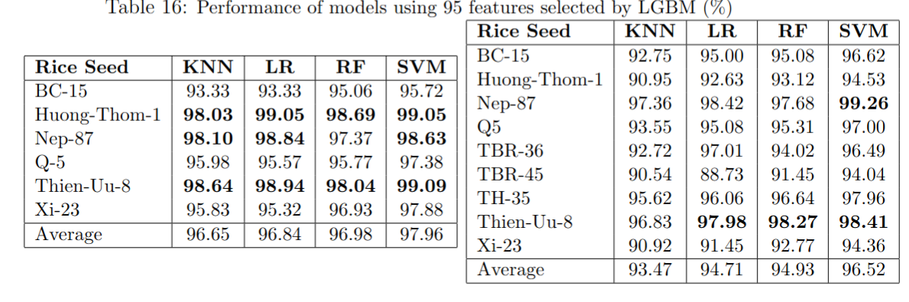

# Rice Seed Classification

A comprehensive machine learning project for classifying different varieties of rice seeds using advanced computer vision and feature extraction techniques.


Some papers for referencing which uses the same dataset:
https://www.mica.edu.vn/perso/Vu-Hai/8013a377.pdf
https://www.sciencedirect.com/science/article/pii/S2405844024099729
https://www.sciencedirect.com/science/article/pii/S1574954125000536

##  Overview

This project implements an automated rice seed classification system that can identify and classify different varieties of rice seeds based on their morphological, color, and texture characteristics. The system extracts multiple types of features from rice seed images and uses machine learning algorithms to achieve high classification accuracy.

## Objectives

- **Automated Classification**: Classify rice seeds into different varieties without manual intervention
- **Multi-feature Analysis**: Extract comprehensive features including shape, color, texture, and geometric properties
- **High Accuracy**: Achieve reliable classification performance across multiple rice varieties
- **Scalable Solution**: Provide a framework that can be extended to new rice varieties

## Rice Varieties in Dataset

The system currently supports classification of the following rice varieties:

- **BC-15**: A high-yield variety
- **Huong Thom (Huongthom)**: Fragrant rice variety
- **Nep-87 (Nep87)**: Glutinous rice variety
- **Q-5 (Q5)**: Quality rice variety
- **Thien Uu (Thien_uu)**: Premium rice variety
- **Xi-23 (Xi23)**: Specialty rice variety
- **TBR-36**: Traditional variety
- **TBR-45**: Traditional variety
- **TH3-5**: Hybrid variety

## Feature Extraction

The system extracts multiple types of features from rice seed images:

### Shape Features
- **Basic Geometric Features**: Area, perimeter, length, width, aspect ratio
- **Advanced Shape Descriptors**: Roundness, compactness, solidity, convexity
- **Elliptical Properties**: Major/minor axis lengths, elliptical deviation
- **Contour Analysis**: Contour complexity, distance ratios, bending energy

### Color Features
- **Multi-color Space Analysis**: BGR, HSV, LAB, YCrCb, XYZ color spaces
- **Statistical Moments**: Mean, standard deviation, skewness, kurtosis
- **Entropy and Wavelets**: Shannon entropy, wavelet coefficients
- **Color Variance Ratios**: Inter-channel variance relationships
- **Percentile Features**

### Texture Features
- **Local Binary Patterns (LBP)**: Uniform LBP histograms
- **Gray Level Co-occurrence Matrix (GLCM)**: Contrast, correlation, energy, homogeneity
- **Texture Statistics**: Mean, standard deviation, uniformity, third moment

### Advanced Features
- **Zernike Moments**: Rotation-invariant shape descriptors (up to 8th degree)
- **Central Moments**: Statistical shape characterization
- **Distance Transform**: Thickness analysis and relative measurements


## Installation

### Prerequisites
- Python 3.8 or higher

### Setup

1. **Clone the repository**:
   ```bash
   git clone <repository-url>
   cd Rice-seed-classification
   ```


2. **Install dependencies**:
   ```bash
   pip install -r requirements.txt
   ```

## Classification Pipeline

The complete classification pipeline includes:

1. **Image Preprocessing**: Gaussian blur, thresholding, contour detection
2. **Feature Extraction**: Multi-domain feature computation
3. **Feature Selection**: Identifying most discriminative features
4. **Model Training**: Training multiple ML algorithms
5. **Evaluation**: Cross-validation and performance metrics

## 📊 Results
